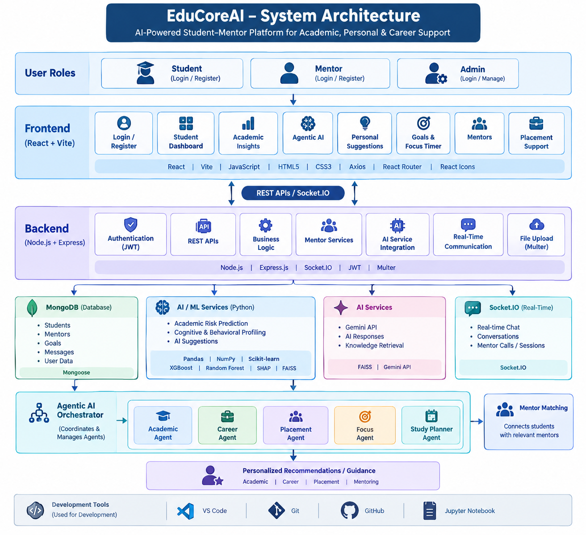

#### EduCoreAI 🎓🤖

#### 

#### AI-Powered Student–Mentor Platform for Academic, Personal \& Career Support

#### 

#### EduCoreAI is an AI-powered student–mentor platform designed to provide personalized academic guidance, career support, and mentor interaction in a unified environment.

#### 

#### The platform combines \*\*Artificial Intelligence, Agentic AI, student analytics, mentor matching, real-time communication, and personalized recommendations\*\* to help students identify challenges, improve their academic performance, plan their careers, and connect with suitable mentors.

#### 

#### 📌 Overview

#### 

#### Students often face difficulties related to academics, career planning, placement preparation, study management, and personal challenges. EduCoreAI brings these support systems together in one platform.

#### 

#### The system analyzes student-related information such as:

#### 

#### \* Academic performance

#### \* Attendance

#### \* Backlogs

#### \* Study habits

#### \* Stress and motivation

#### \* Learning behavior

#### \* Career interests

#### \* Placement goals

#### 

#### Based on this information, EduCoreAI provides personalized insights and connects students with relevant mentors.

#### 

#### 🎯 Objectives

#### 

#### \* Provide personalized academic guidance to students.

#### \* Identify students who may require additional academic support.

#### \* Provide AI-based recommendations and insights.

#### \* Support students in setting and achieving academic and career goals.

#### \* Match students with suitable mentors.

#### \* Enable student–mentor communication.

#### \* Provide career and placement-oriented guidance.

#### \* Integrate Agentic AI to assist students with different types of problems.

#### \* Create a centralized platform for student development and mentoring.

#### 

#### ✨ Key Features

#### 

#### 🤖 AI-Powered Student Insights

#### 

#### EduCoreAI analyzes student information and generates personalized insights related to academic performance, study behavior, motivation, and other relevant factors.

#### 

#### 📊 Academic Risk Prediction

#### 

#### The platform uses machine-learning techniques to identify potential academic risks using factors such as:

#### 

#### \* CGPA

#### \* Attendance

#### \* Backlogs

#### \* Study hours

#### \* Stress

#### \* Sleep

#### \* Motivation

#### 

#### The academic risk module uses machine-learning models including XGBoost and Random Forest.

#### 

#### 🧠 Cognitive Profiling

#### 

#### The system supports student profiling using personality, behavioral, learning, and related student inputs to provide more personalized recommendations.

#### 

#### 🧩 Agentic AI

#### 

#### EduCoreAI includes an Agentic AI layer designed to analyze student problems and coordinate specialized AI agents.

#### 

#### The project includes agents for areas such as:

#### 

#### \* Academic risk

#### \* Career guidance

#### \* Placement

#### \* Focus and productivity

#### \* Study planning

#### 

#### The Agentic AI module is designed to provide more targeted responses instead of treating every student query in the same way.

#### 

#### 👨‍🏫 Mentor Matching

#### 

#### Students can discover mentors based on areas such as:

#### 

#### \* Development

#### \* Backend Development

#### \* Frontend Development

#### \* Full Stack Development

#### \* AI \& Data

#### \* Cloud

#### \* DSA

#### 

#### The platform supports mentor-oriented interaction and communication.

#### 

#### 💬 Real-Time Communication

#### 

#### EduCoreAI includes communication functionality for student–mentor interaction using:

#### 

#### \* Chat

#### \* Conversations

#### \* Socket.IO

#### \* Call/session functionality

#### 

#### 🎯 Goals \& Focus Timer

#### 

#### Students can create goals and use productivity features such as a focus timer to support consistent study and career preparation.

#### 

#### 💼 Placement Support

#### 

#### The platform includes placement-oriented functionality to help students work toward career and placement goals.

#### 

#### 👤 Role-Based Platform

#### 

#### The application is designed around different user roles, including:

#### 

#### \* Student

#### \* Mentor

#### \* Admin

#### 

#### 🏗️ System Architecture
## System Architecture

The following architecture represents the overall flow of EduCoreAI, including the frontend, backend, database, AI/ML services, Agentic AI, and mentor communication services.

<p align="center">
  
</p>
🧠 AI \& Machine Learning Components

#### 

#### Academic Risk Prediction

#### 

#### The academic risk module considers multiple student-related features and applies machine-learning techniques for prediction.

#### 

#### Models:

#### 

#### \* XGBoost

#### \* Random Forest

#### 

#### Example input factors:

#### text

#### CGPA

#### Attendance

#### Backlogs

#### Stress

#### Sleep

#### Study Hours

#### Motivation

#### ```

#### 

#### Agentic AI

#### 

#### The Agentic AI architecture separates different types of student assistance into specialized agents.


#### Student Problem

#### &#x20;     │

#### &#x20;     ▼

#### Agentic AI Orchestrator

#### &#x20;     │

#### &#x20;     ├── Academic Agent

#### &#x20;     ├── Career Agent

#### &#x20;     ├── Placement Agent

#### &#x20;     ├── Focus Agent

#### &#x20;     └── Study Planner Agent

#### &#x20;     │

#### &#x20;     ▼

#### Personalized Recommendation

#### 

#### 🛠️ Technology Stack

#### 

#### Frontend

#### 

#### \* React

#### \* Vite

#### \* JavaScript

#### \* HTML5

#### \* CSS3

#### \* Axios

#### \* React Router

#### \* React Icons

#### 

#### Backend

#### 

#### \* Node.js

#### \* Express.js

#### \* REST APIs

#### \* Socket.IO

#### \* JWT Authentication

#### \* Multer

#### 

#### Database

#### 

#### \* MongoDB

#### \* Mongoose

#### 

#### AI / Machine Learning

#### 

#### \* Python

#### \* Pandas

#### \* NumPy

#### \* Scikit-learn

#### \* XGBoost

#### \* Random Forest

#### \* SHAP

#### \* FAISS

#### \* Gemini API / AI services

#### 

#### Development Tools

#### 

#### \* Visual Studio Code

#### \* Git

#### \* GitHub

#### \* Jupyter Notebook

#### 

#### 📁 Project Structure

#### 

#### 

#### EduCoreAI/

#### │

#### ├── backend/

#### │   ├── config/

#### │   ├── controllers/

#### │   ├── middleware/

#### │   ├── models/

#### │   ├── routes/

#### │   ├── services/

#### │   ├── socket/

#### │   ├── sockets/

#### │   ├── utils/

#### │   └── server.js

#### │

#### ├── frontend/

#### │   ├── agents/

#### │   ├── models/

#### │   ├── routes/

#### │   └── src/

#### │       ├── api/

#### │       ├── components/

#### │       ├── pages/

#### │       ├── styles/

#### │       └── assets/

#### │

#### ├── educore-ai/

#### │

#### ├── AuthContext.jsx

#### ├── .gitignore

#### └── README.md

#### 

#### ⚙️ Getting Started

#### 

#### 1\. Clone the Repository

#### git clone https://github.com/codebysoujanya/EduCoreAI.git

#### cd EduCoreAI

#### 

#### 2\. Install Backend Dependencies

#### cd backend

#### npm install

#### 

#### 3\. Configure Environment Variables

#### 

#### Create a `.env` file inside the `backend` directory.

#### 

#### Example:

#### 

#### ```env

#### PORT=5000

#### MONGO\_URI=your\_mongodb\_connection\_string

#### JWT\_SECRET=your\_jwt\_secret

#### GEMINI\_API\_KEY=your\_gemini\_api\_key

#### OPENAI\_API\_KEY=your\_openai\_api\_key

#### 

#### 4\. Start the Backend

#### 

#### From the `backend` directory:

#### npm start

#### or, if your package configuration uses the development script:

#### npm run dev

#### 

#### 5\. Install Frontend Dependencies

#### 

#### Open another terminal:

#### cd frontend

#### npm install

#### 

#### 6\. Start the Frontend


#### npm run dev

#### The Vite development server will provide a local URL, typically:

#### http://localhost:5173

#### 

#### 🔐 Environment Variables

#### 

#### For security, environment-specific credentials are excluded from the repository.

#### 

#### The project uses environment variables for sensitive configuration such as:

#### 

#### \* MongoDB connection

#### \* JWT secret

#### \* AI API keys

#### \* Other backend configuration

#### 

#### A teammate should create their own `.env` file using the required variable names.

#### 

#### 🔄 Application Flow

#### 

#### 

#### Student

#### &#x20;  │

#### &#x20;  ▼

#### Login / Register

#### &#x20;  │

#### &#x20;  ▼

#### Student Dashboard

#### &#x20;  │

#### &#x20;  ├── Academic Insights

#### &#x20;  │

#### &#x20;  ├── Agentic AI

#### &#x20;  │

#### &#x20;  ├── Personal Suggestions

#### &#x20;  │

#### &#x20;  ├── Goals

#### &#x20;  │

#### &#x20;  ├── Focus Timer

#### &#x20;  │

#### &#x20;  ├── Mentors

#### &#x20;  │

#### &#x20;  └── Placement Support

#### &#x20;         │

#### &#x20;         ▼

#### &#x20;     Mentor Interaction

#### &#x20;         │

#### &#x20;         ▼

#### &#x20;  Personalized Guidance

#### 

#### 🔮 Future Enhancements

#### 

#### Planned improvements may include:

#### 

#### \* Enhanced AI personalization

#### \* More advanced Agentic AI workflows

#### \* Improved mentor recommendation algorithms

#### \* Expanded real-time video/audio communication

#### \* Advanced student analytics

#### \* Improved placement recommendations

#### \* Additional AI-based learning assistance

#### \* Deployment of the complete platform to a production environment

#### 

#### GitHub:https://github.com/codebysoujanya/EduCoreAI

#### 

#### ⭐ Project Vision

#### 

#### > EduCoreAI aims to bring AI-powered academic guidance, personalized student support, career assistance, and human mentorship together in one intelligent platform.

#### 

